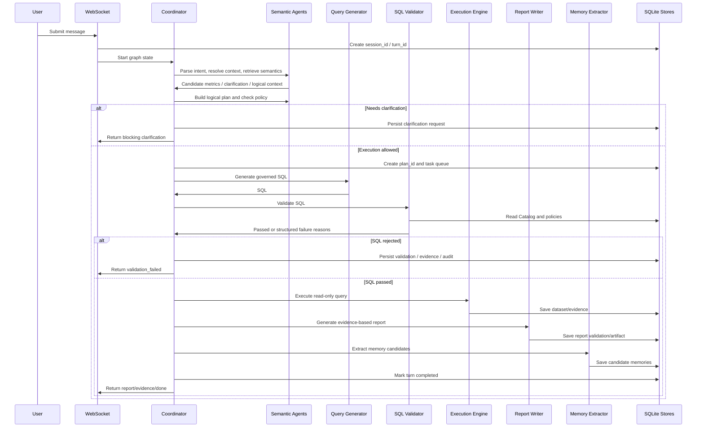

# Enterprise Data Agent

企业级数据智能分析 Agent，目标不是简单的 ChatBI 或 NL2SQL，而是一个可规划、可执行、可验证、可审计、可复用的数据分析智能体系统。

系统通过多 Agent 协作理解用户分析意图，结合语义指标、Catalog、权限策略和上下文生成结构化分析计划，再通过 SQL Validator、执行引擎和证据链机制完成可追溯的数据分析。LLM 负责理解、规划和解释，关键数字、图表和报告必须来自确定性执行结果与持久化 evidence。

## 架构概览图

```text
┌─────────────────────────────────────────────────────────────────┐
│                    前端 (Next.js + React)                        │
│  ┌──────────────┐  ┌─────────────────────┐  ┌────────────────┐  │
│  │ Session /    │  │ ChatInterface       │  │ FloatingDrawer │  │
│  │ Sidebar      │  │ + 消息流             │  │ 代码/图表/报告  │  │
│  └──────────────┘  │ + AgentStatusCards  │  └────────────────┘  │
│                    └─────────────────────┘                      │
└──────────────────────────┬──────────────────────────────────────┘
                           │ WebSocket
                           │ ws://localhost:8000/ws/chat/{session_id}
┌──────────────────────────▼──────────────────────────────────────┐
│                    后端 API (FastAPI)                            │
│                    WebSocket-only Chat Entry                     │
└──────────────────────────┬──────────────────────────────────────┘
                           │
┌──────────────────────────▼──────────────────────────────────────┐
│                    LangGraph 多 Agent 系统                       │
│  ┌───────────────────────────────────────────────────────────┐   │
│  │        Coordinator P1：规划 / 调度 / 监督 / 重试 / 终止     │   │
│  └─────┬────────────┬────────────┬────────────┬──────────────┘   │
│        │            │            │            │                  │
│        ▼            ▼            ▼            ▼                  │
│   Intent/Context  Semantic     Policy      Query Generator       │
│   Resolver        Retriever    Checker          │                │
│        │            │            │              ▼                │
│        └────────────┴────────────┴──────► SQL Validator          │
│                                                │                 │
│                                                ▼                 │
│                                      Execution Engine            │
│                                                │                 │
│                            ┌───────────────────┴─────────────┐   │
│                            ▼                                 ▼   │
│                     Report Writer                    Memory Extractor │
└──────────────────────────┬──────────────────────────────────────┘
                           │
┌──────────────────────────▼──────────────────────────────────────┐
│                      持久化与治理层                              │
│  ┌──────────────────────┐  ┌──────────────────────────────────┐  │
│  │ Session Store SQLite │  │ Semantic Registry SQLite          │  │
│  │ session/turn/plan    │  │ 指标/Catalog/权限/治理审计         │  │
│  │ task/evidence/audit  │  └──────────────────────────────────┘  │
│  │ memory candidates    │                                        │
│  └──────────────────────┘                                        │
└──────────────────────────┬──────────────────────────────────────┘
                           │
┌──────────────────────────▼──────────────────────────────────────┐
│                    企业数据源 / 本地物化结果                      │
│        只读数据库连接 + SQL 校验后执行 + CSV/图表/报告产物         │
└─────────────────────────────────────────────────────────────────┘
```

## 核心执行流程图



## 技术栈

- Backend: Python, FastAPI, WebSocket, LangGraph, LangChain Core
- Agent Orchestration: LangGraph P1 workflow
- LLM Provider: DeepSeek via `langchain-deepseek`
- SQL Validation: `sqlglot` AST validation
- Data Processing: pandas, numpy, matplotlib, seaborn, plotly
- Persistence: SQLite
  - `sessions.db`: sessions, turns, plans, tasks, evidence, validations, audit events, memory candidates
  - semantic registry: metrics, metric versions, synonyms, Catalog, access policies, governance audit
- Frontend: Next.js, React, TypeScript, Zustand, Tailwind CSS, lucide-react
- Auth/IAM: local mode and OIDC/JWT-compatible auth context

## 快速开始

### 环境要求

- Python 3.11+
- Node.js 20+
- 已安装项目依赖
- 推荐虚拟环境：`conda activate agent`

可选环境变量：

```powershell
# LLM，可不配置；未配置时部分节点会使用 fallback，但正式分析报告质量会受影响
$env:DEEPSEEK_API_KEY="your_key"

# 前端默认已连接 ws://localhost:8000；如需修改：
$env:NEXT_PUBLIC_WS_URL="ws://localhost:8000"

# 企业数据库源示例。P1 当前本地执行支持 sqlite，生产仓库适配放在后续阶段。
$env:DATABASE_SOURCES_JSON='[{"alias":"sales_dw","dialect":"sqlite","read_only":true,"allowed_schemas":["mart"],"connection_ref":"SALES_DW_URI"}]'
$env:SALES_DW_URI="D:\path\to\sales_dw.sqlite"
```

### 安装依赖

后端：

```powershell
conda activate agent
pip install -r requirements.txt
```

前端：

```powershell
cd frontend
npm install
```

### 启动命令

后端服务：

```powershell
conda activate agent
uvicorn backend.api.main:app --host 0.0.0.0 --port 8000 --reload
```

前端服务：

```powershell
cd frontend
npm run dev
```

### 访问地址

- 前端页面：http://localhost:3000
- WebSocket 地址：`ws://localhost:8000/ws/chat/{session_id}`
- 静态图表文件：http://localhost:8000/static/figures/

注意：当前后端产品入口是 WebSocket，不提供 REST Chat API、CLI 或 Streamlit 入口。

### 使用流程

1. 启动后端和前端。
2. 打开 http://localhost:3000。
3. 新建或进入一个聊天会话。
4. 输入分析问题，例如“分析上周净销售额，用中文简要说明”。
5. 系统会创建 `session_id` 和本次请求的 `turn_id`。
6. 如果问题存在业务歧义，系统会阻塞并返回澄清问题。
7. 如果可以执行，系统会创建 `plan_id`，调度多 Agent 执行。
8. SQL 查询必须经过 SQL Validator，通过后才会执行。
9. 执行结果、SQL 校验、报告、审计事件和记忆候选都会持久化。

## 项目结构

```text
.
├── backend/
│   └── api/
│       ├── main.py                 # FastAPI 应用，WebSocket 唯一业务入口
│       └── websocket/
│           └── handler.py          # WebSocket 消息处理和图执行流推送
├── configs/
│   ├── settings.py                 # 项目配置、IAM、SQL Validator 配置
│   └── semantic_seed.json          # 本地语义注册表 seed
├── data/
│   ├── sessions.db                 # 会话、turn、plan、evidence、audit、memory candidates
│   ├── semantic_registry.db        # 语义指标、Catalog、权限、治理信息
│   └── outputs/                    # 图表、报告等输出目录
├── frontend/
│   ├── package.json
│   └── src/
│       ├── hooks/useChat.ts        # 前端聊天 WebSocket 状态处理
│       ├── lib/websocket.ts        # WebSocket 客户端
│       └── components/             # UI 组件
├── src/
│   ├── agents/
│   │   ├── coordinator_p1.py       # P1 Coordinator，规划、调度、监督、重试
│   │   ├── semantic_pipeline.py    # Intent/Context/Semantic/Policy/SQL/Execution 节点
│   │   ├── memory_extractor.py     # 记忆候选提取 Agent
│   │   ├── report_writer.py        # 基于 evidence 的报告生成
│   │   ├── chat.py                 # 会话兜底 Agent
│   │   └── ...
│   ├── graph/
│   │   ├── builder.py              # LangGraph P1 图构建
│   │   └── state.py                # Graph 状态和数据契约
│   ├── persistence/
│   │   ├── session_store.py        # session/turn/plan/task/evidence/audit/memory 存储
│   │   └── semantic_store.py       # 语义注册表、Catalog、治理存储
│   ├── security/
│   │   ├── auth_context.py         # 本地/OIDC/JWT 身份上下文
│   │   └── sql_validator.py        # 生产 SQL Validator
│   ├── semantic/
│   │   └── registry.py             # 语义注册表 facade
│   └── storage/
│       └── database_connector.py   # 只读数据库执行与结果物化
├── tests/
│   └── test_graph_build.py         # P1 图构建测试
├── requirements.txt
└── README.md
```

## License

MIT License

Copyright (c) 2026

Permission is hereby granted, free of charge, to any person obtaining a copy
of this software and associated documentation files (the "Software"), to deal
in the Software without restriction, including without limitation the rights
to use, copy, modify, merge, publish, distribute, sublicense, and/or sell
copies of the Software, and to permit persons to whom the Software is
furnished to do so, subject to the following conditions:

The above copyright notice and this permission notice shall be included in all
copies or substantial portions of the Software.

THE SOFTWARE IS PROVIDED "AS IS", WITHOUT WARRANTY OF ANY KIND, EXPRESS OR
IMPLIED, INCLUDING BUT NOT LIMITED TO THE WARRANTIES OF MERCHANTABILITY,
FITNESS FOR A PARTICULAR PURPOSE AND NONINFRINGEMENT. IN NO EVENT SHALL THE
AUTHORS OR COPYRIGHT HOLDERS BE LIABLE FOR ANY CLAIM, DAMAGES OR OTHER
LIABILITY, WHETHER IN AN ACTION OF CONTRACT, TORT OR OTHERWISE, ARISING FROM,
OUT OF OR IN CONNECTION WITH THE SOFTWARE OR THE USE OR OTHER DEALINGS IN THE
SOFTWARE.
